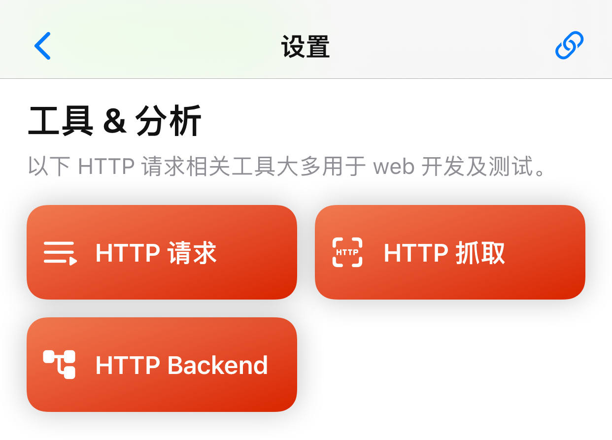
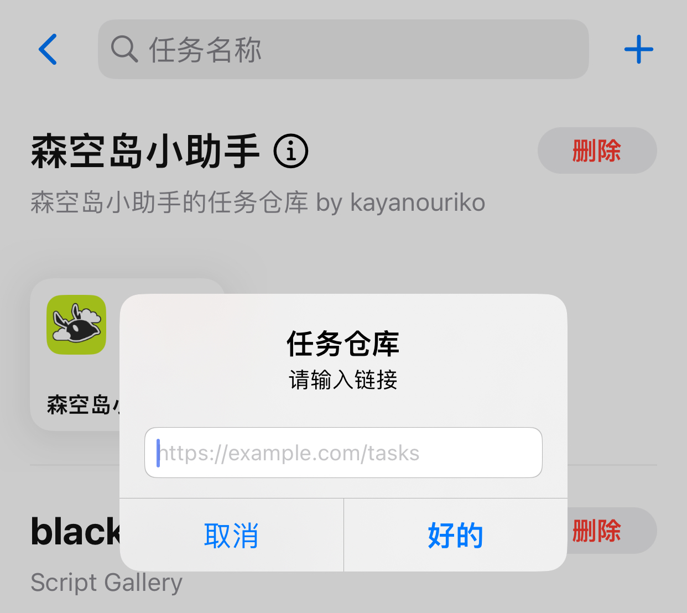
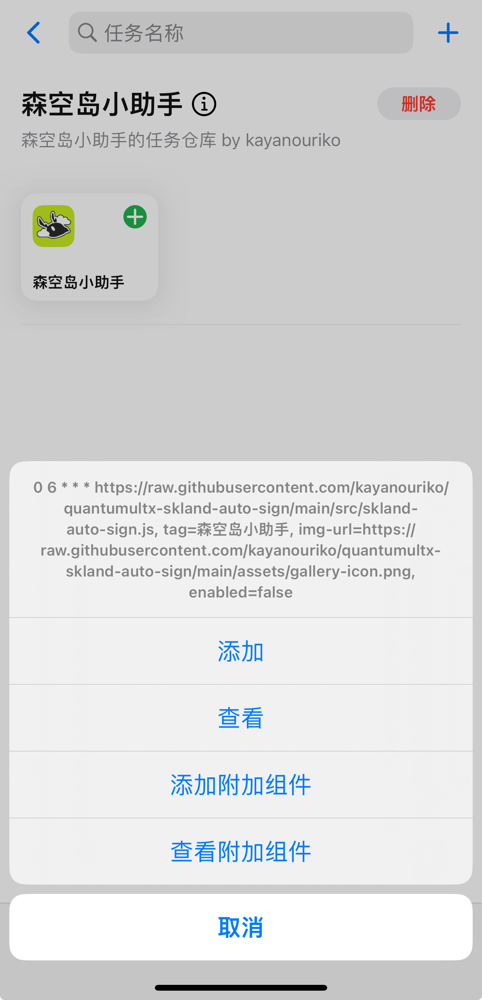
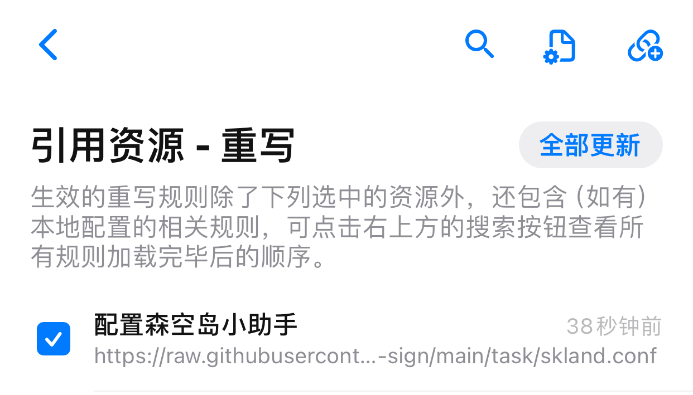
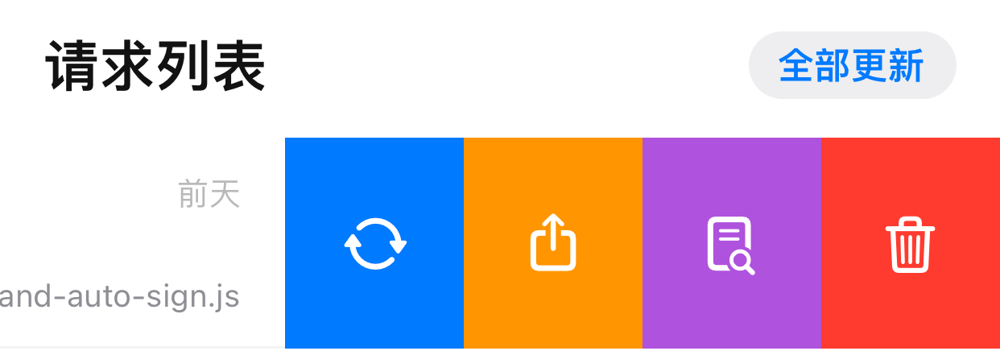
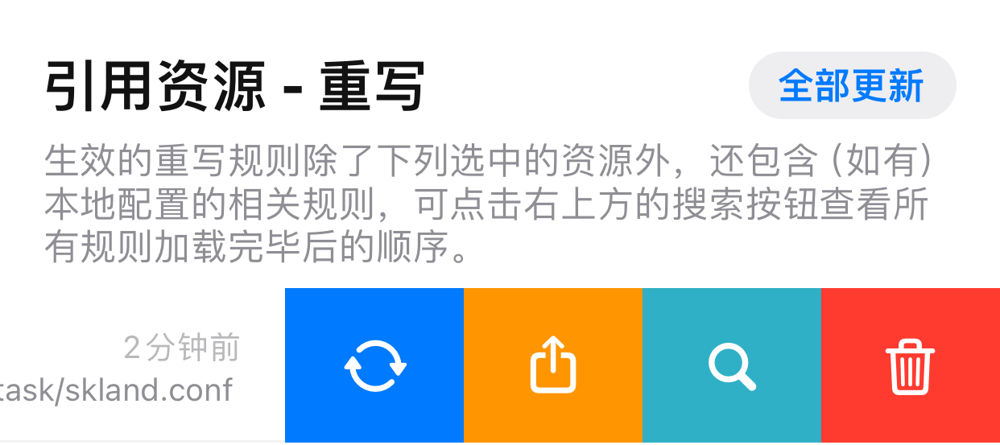
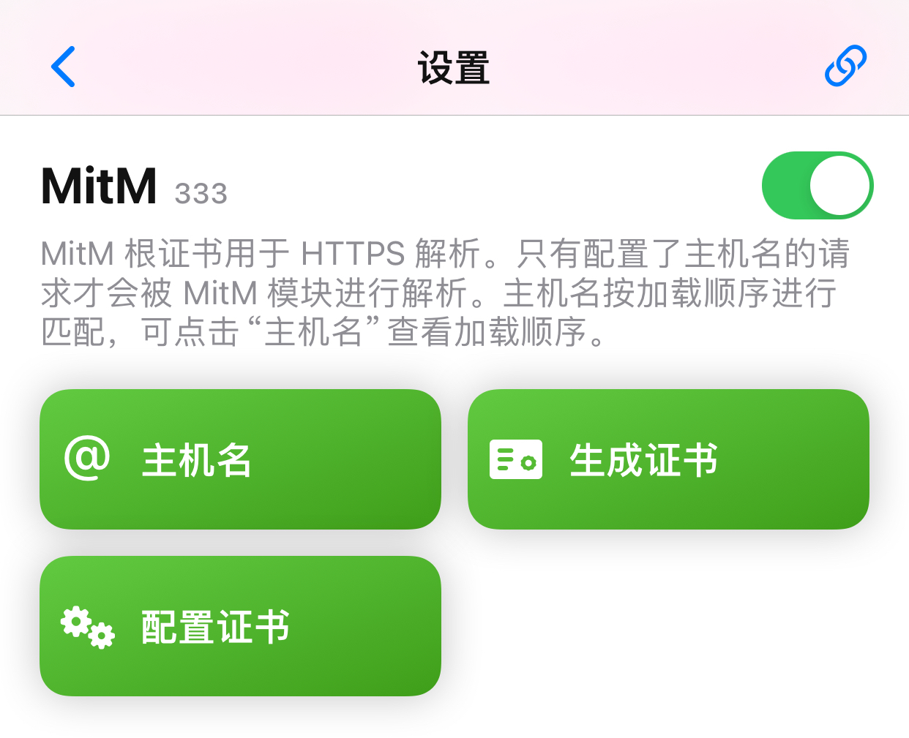
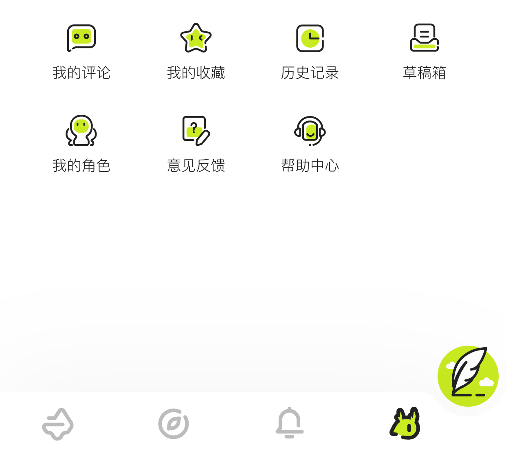
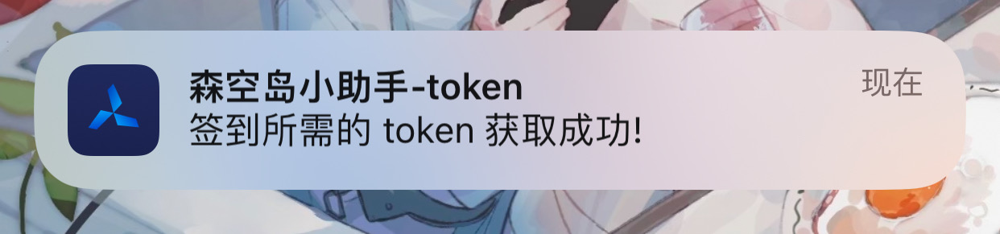
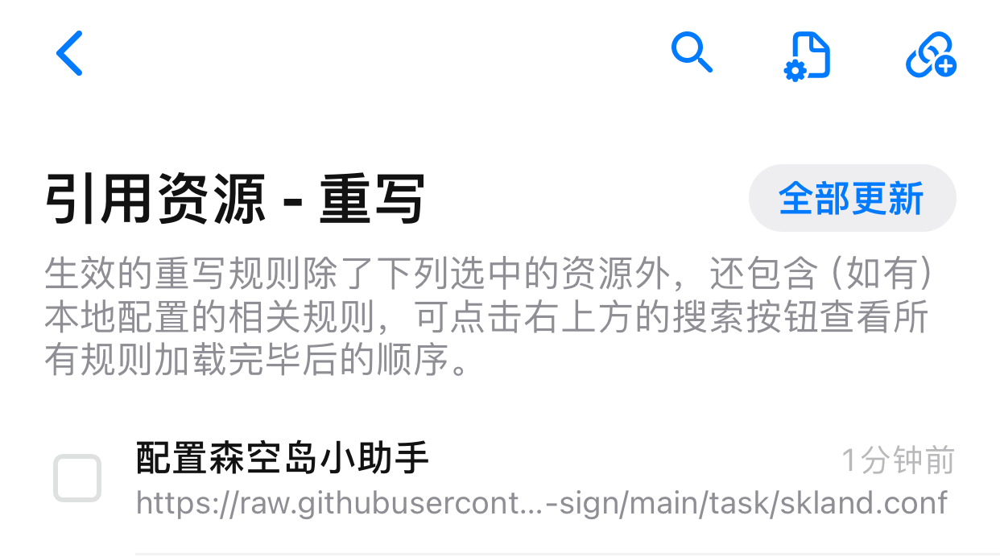

# 森空岛小助手

 

一个 quantumultx 脚本, 主要用于森空岛游戏签到的自动运行.

## 前言

1. 当使用该项目的前提下, 一个手机对应一个账号, 所以不支持多账号的功能是理所应当的. 当你有多账号需求时, 请使用其他相关项目.

2. 使用该项目之前, 你需要提前了解如何使用 quantumultx 拉取远程仓库和执行脚本.

3. 目前 quantumultx 并不会自动升级远程配置的脚本, 当你发现脚本功能不可用时, 可先看该项目是否已经更新修复了, 再尝试在 quantumultx 内更新脚本以获取最新的修复.

## 更新日志

* [重写文件] v1.2.0(20231017)
   1. [修复] 获取到的 token 需要解码后使用.

> 仅重写文件更新, 正常使用的用户不需要更新

<details>
<summary>历史更新日志</summary>

* v1.2.0(20230921) 破坏性更新
    
    1. [新增] 支持森空岛账号绑定的所有明日方舟游戏角色进行签到.
    2. [修复] B服账号无法签到.
    3. [修复] 修正请求逻辑, 使用最新的鹰角签名请求头算法进行请求. [来自 @sklandplus](https://github.com/sklandplus/sklandplus)
    4. [BUG] 这版自动签到后有概率森空岛 app 需要重新登录, 不过 app 有一键登录功能, 也不算大问题, 找重写接口参数眼睛都找花了, 暂时先这样吧.

> 该版本需要同时更新脚本主体和重写列表, 并且需要重新获取必要参数, 详细请见下列 task-8 task-9 图例(如何更新), rewrite-2 图例(如何获取必要参数)

* v1.1.0(20230919)

    1. [脚本主体] 针对 yj 新增验证做出的临时修复. [@感谢参考逻辑](https://github.com/enpitsuLin/skland-daily-attendance)

> 森空岛昨天追加了加密签名, 目前临时修复了, 基本是模拟旧版本接口的参数. 
>
> 等新版 app 全面升级后, 这方法估计很快就失效了. 能用一天是一天吧.
>
> 只能期待后续等新版安卓包释出后有大佬反编译出算法, 还有 yj 不要给签到接口加上 CAPTCHA 验证.

* v1.0.0(20230908)    
    1. 初版 🎉
</details>

## 如何使用

### 引入资源

|          |
| :------------------------------: |
| 打开应用底部最右侧图标<br>task-1 |

|  |
| :----------------------: |
| 点击 HTTP 请求<br>task-2 |

|                    |
| :----------------------------------------: |
| 点击导航栏最左侧图标进入仓库页面<br>task-3 |

|                |
| :------------------------------------: |
| 点击右上角加号, 输入仓库地址<br>task-4 |

```
// 仓库地址连接
https://raw.githubusercontent.com/kayanouriko/quantumultx-skland-auto-sign/main/task/gallery.json
```

|                                                 |
| :---------------------------------------------------------------------: |
| 点击森空岛小助手, 在弹出的 sheet 中分别选择添加和添加附加组件<br>task-5 |

|  <br>   |
| :-----------------------------------------------------: |
| 请求列表和重写列表如图所示即为添加成功<br>task-6 task-7 |

* 注1: 脚本默认执行时间为每天早上6点整, 你可以根据自己的需求自行修改.

|                         <br>                          |
| :---------------------------------------------------------------------------------------------------: |
| 请求列表和重写列表如图所示<br>可以左滑点击第一个图标或者点击上方全部更新按钮进行更新<br>task-8 task-9 |

### 获取脚本执行必须参数

|            |
| :--------------------------------: |
| 保证重写列表的为打开状态<br>task-7 |

|              |
| :----------------------------------: |
| 保证重写列表更新为最新版本<br>task-9 |

|          |
| :---------------------------------: |
| 保证MitM功能为打开状态<br>rewrite-1 |

|                             |
| :----------------------------------------------------: |
| 打开森空岛 app, 点击`我的标签页-我的角色`<br>rewrite-2 |

|                |
| :---------------------------------------: |
| 此时会收到获取参数成功的通知<br>rewrite-3 |

|  |
| :-------------------------: |
|  取消打勾操作<br>rewrite-4  |

至此, 脚本可以运行了.

## 感谢

1. [sklandplus](https://github.com/sklandplus/sklandplus) 森空岛 社区(非官方) 工具库 TypeScript Monorepo
2. [JavaScript-MD5](https://github.com/blueimp/JavaScript-MD5) js 原生 md5 算法实现
3. [yuanyuan95](https://blog.csdn.net/yuanyuan95/article/details/127811272) js 原生 hmac-sha256 算法实现 
